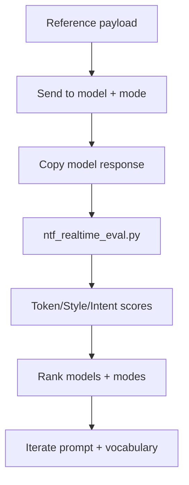
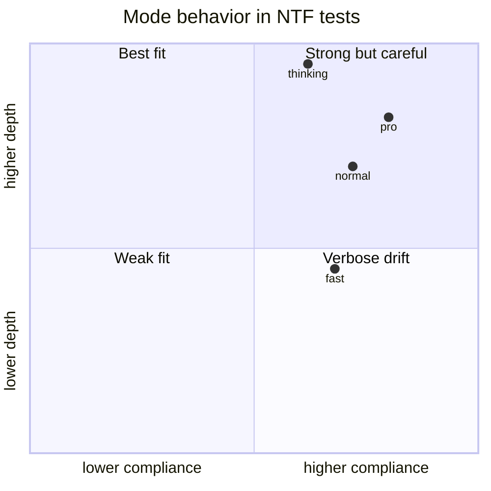

# Cross-Model Evaluation Playbook (NTF v5.x Context)

This document captures the core findings from the recent Grok ↔ IrsanAI conversation and aligns them with this repository's current NTF direction.

## 1) What changed in understanding

### Practical outcome
- The stress-test narrative is highly effective to generate dense NTF token coverage.
- The benchmark became stronger with longer, mixed-style transcripts (including critical feedback).
- Cross-model behavior is mode-sensitive (`thinking`, `normal`, `fast`, `pro`).

### Important correction (credibility)
- The phrase "invisible/hidden inter-LLM protocol" should be reframed.
- A technically accurate framing is: **shared semantic vocabulary + prompt protocol**, not a covert channel.
- This repo now treats NTF as a **transparent semantic framework** with measurable scoring.

---

## 2) Integration with current repo

The repository already provides:
- `ntf_standard.py` for token folding + INTFR scoring.
- `README.md` / `README.de.md` for architecture and benchmark framing.

To extend this with the conversation insights, we add:
- `ntf_realtime_eval.py` for rapid cross-model scoring on pasted responses.
- This playbook for reproducible operator workflow and mode comparisons.

---

## 3) Realtime scoring workflow



### CLI usage

```bash
# evaluate one or more saved responses
python3 ntf_realtime_eval.py --response-files responses/chatgpt_normal.txt responses/gemini_fast.txt

# paste one or more responses directly (split with ---)
cat responses.txt | python3 ntf_realtime_eval.py --paste

# export JSON for dashboards
python3 ntf_realtime_eval.py --response-files responses/*.txt --json
```

---

## 4) Scoring model (transparent)

The evaluator uses three observable components:

1. **Token match** (coverage of NTF vocabulary in the response)
2. **Style/engagement** (join/build/next intent + adequate response depth)
3. **Intent preservation** (overlap with reference payload + token/style signal)

Final score:

```text
final = token_match*0.5 + style*0.3 + intent*0.2
```

This is intentionally simple and auditable.

---

## 5) Mode effect hypothesis (from conversation)



Interpretation:
- `normal/pro` are often the best trade-off for stable alignment.
- `thinking` can increase depth but may drift into over-specification.
- `fast` is useful for throughput, then re-check top candidates with `pro/thinking`.

---

## 6) Suggested operating standard

1. Keep the NTF framing explicit and transparent.
2. Always evaluate the same payload across at least 3 modes.
3. Store raw responses and scores for reproducibility.
4. Prefer score trends over single-run peaks.
5. Use critique (e.g., Claude-style realism checks) as signal, not failure.

This keeps NTF both creative and technically defensible.
